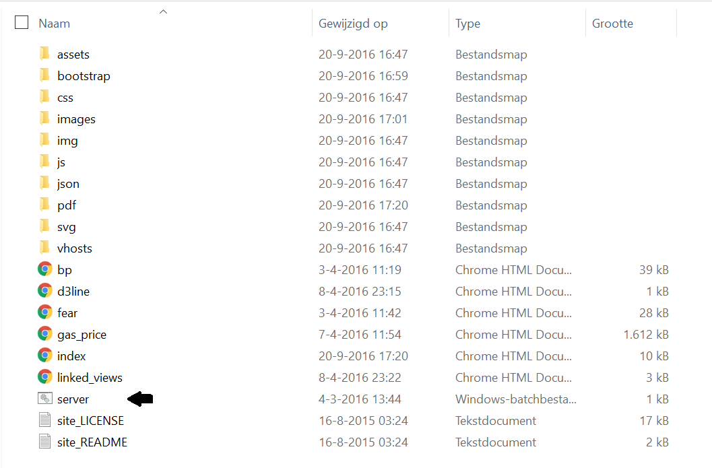
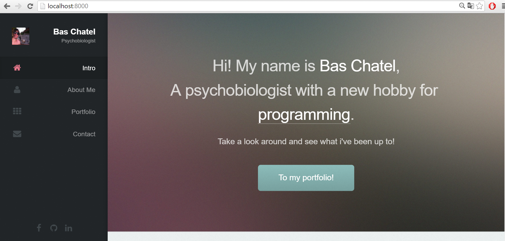
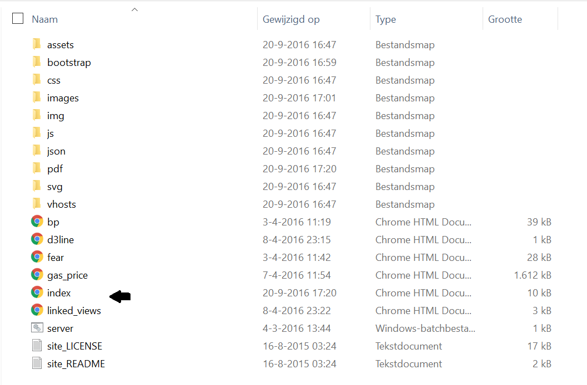

# Website

### This is a site that will contain all my past projects, references to important sites (linkedin, github etc). A portfolio if you will.

#### Usage:

At this stage the site is just code, but it can allready be viewed in a browser. As you are now on my github account, you can download the whole website file (see above). Once downloaded, you first have to open a local host to host the site. To do this, click on the server.bat file. 

Then go to your browser and type in: 

##### localhost:8000

Or if this doesn't work, you can always open the site by clicking the index.html file.

